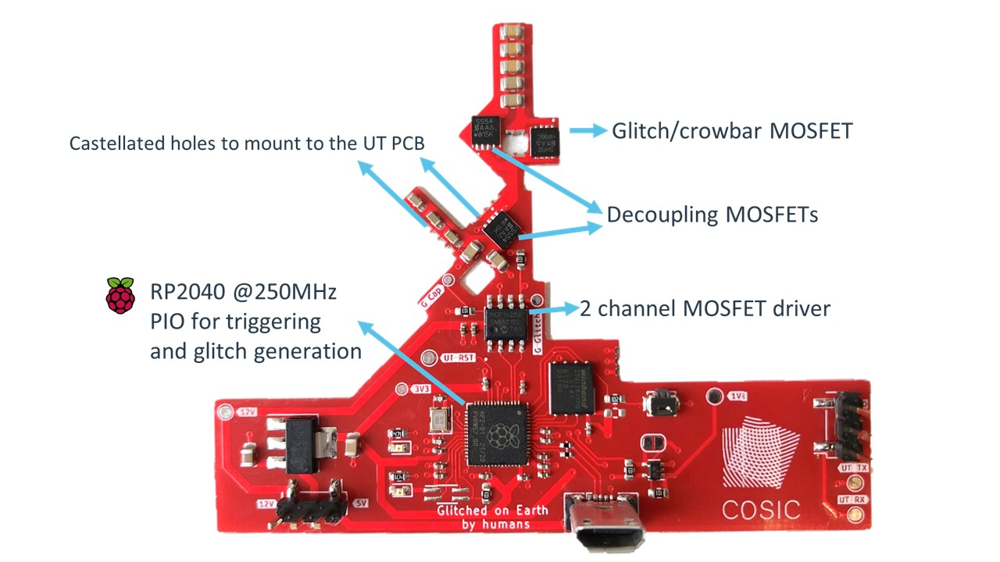
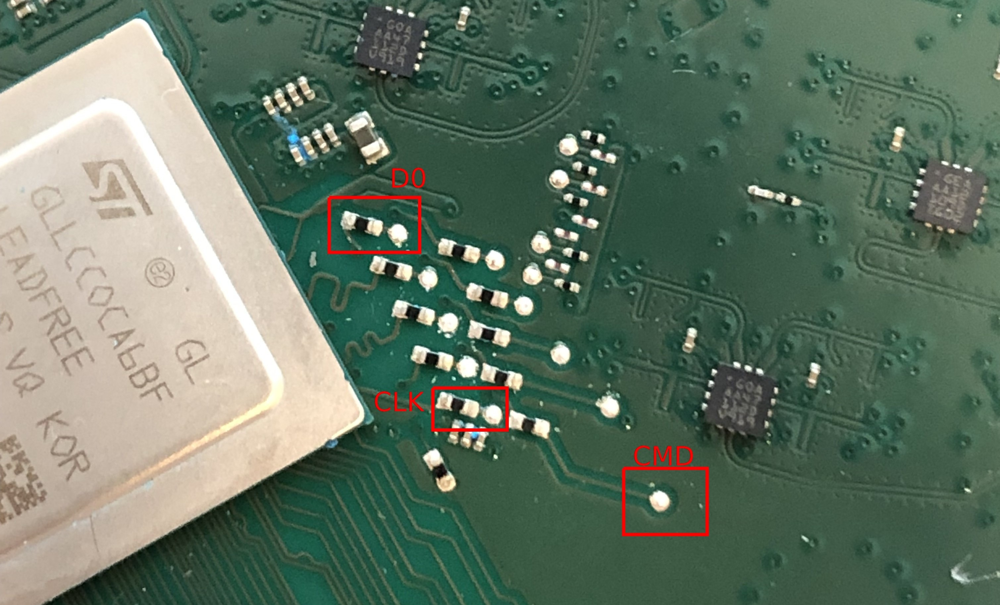
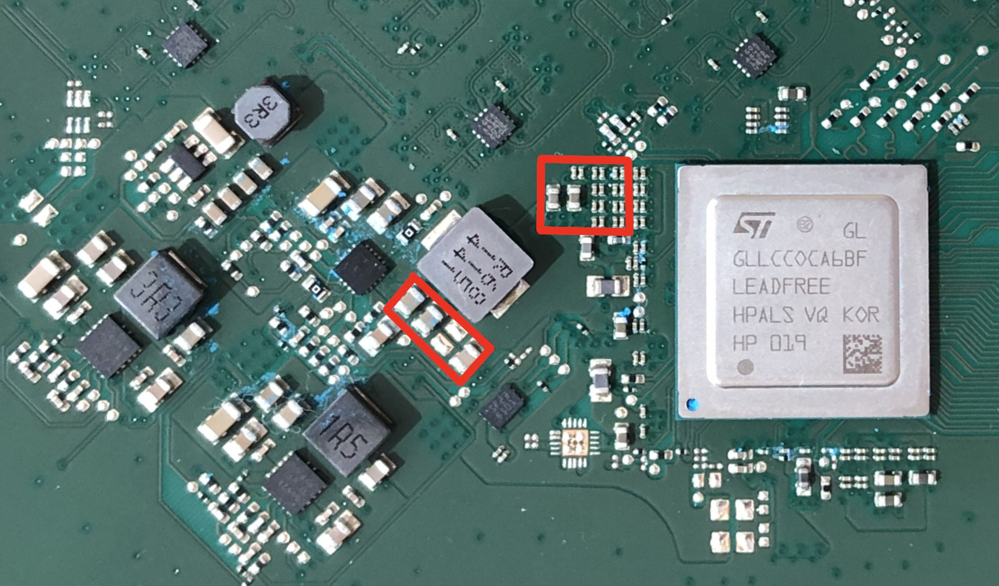
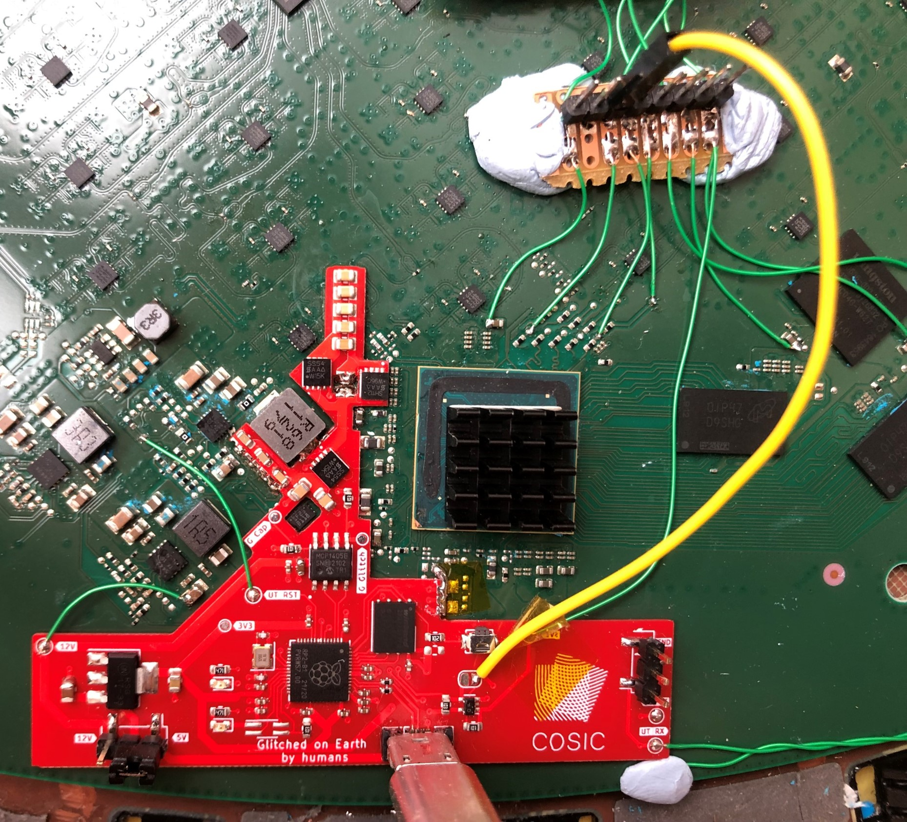

# Starlink User Terminal Modchip
This repository accompanies the talk titled "Glitched on Earth by Humans: A Black-Box Security Evaluation of the SpaceX Starlink User Terminal".
A slide deck is available [here](./GlitchedOnEarth_slides.pdf), a recording of the talk [is available on YouTube](https://www.youtube.com/watch?v=myKs04lfuy8).

The talk covers how we managed to execute arbitrary code on the Starlink User Terminal using a custom modchip that performs voltage fault injection.
The modchip can be used to bypass signature verification during execution of the System-on-Chip (SoC) ROM bootloader (BL1). This allows to execute arbitrary code on the SoC from BL2 onwards and allows to further explore the Starlink User Terminal and networking side of the system. 
We provide the modchip design so that other researchers can build upon our work.

# 🚨 USE AT YOUR OWN RISK 🚨
Even though we tested and use the provided modchip design, it is possible to cause permanent damage to a user terminal using this modchip.
Similarly, disassembling the user terminal may result in permanent damage and will likely void your warranty.

## Modchip design overview
The modchip is controlled by a RP2040 microcontroller that triggers on the eMMC D0 line and creates two pulses with a (programmable) delay and offset for the MOSFET driver.
One of these pulses controls the glitch MOSFET, when the gate of this MOSFET is driven high the SoC core voltage supply will be shorted to ground. The second pulse generated by the RP2040 allows to control two MOSFETs that can enable/disable two capacitor banks. These capacitors are required for the UT to fully boot, but the capacitors banks cannot be enabled during the voltage glitch as this would prevent us from obtaining the desired fault.

The schematic and gerbers to produce your own modchip are provided [here](./pcb/).

## Prerequisites
* Disassemble your UT. Stop here if you do not want to void your UT warranty or if you are not willing to risk permanent damage.
    * [several](https://www.youtube.com/watch?v=omScudUro3s) [videos](https://youtu.be/iOmdQnIlnRo) [on](https://www.youtube.com/watch?v=yBnOS7V3oS4) [YouTube](https://youtu.be/-v7E7JIrW5Y) demonstrate the process.
* Read the contents of the eMMC chip. Make a backup!
    * The eMMC chip can be read in-circuit by connecting to the CMD, CLK and D0 test points. 
    * The eMMC expects 1V8 logic levels!
    * Several tools exist to read eMMC chips, a good and cheap ($12) option is the [Low Voltage eMMC Adapter by the exploitee.rs](https://shop.exploitee.rs/shop/p/low-voltage-emmc-adapter).
* You will have to extract, patch and repackage the different boot stages to disable signature verification.
    * The eMMC layout is documented in the [U-Boot GPL release](https://github.com/SpaceExplorationTechnologies/u-boot/releases/tag/sx_2022_05_03) in the file `spacex_catson_boot.h`.
    * More information on extracting the firmware can be found in our [blog post](https://www.esat.kuleuven.be/cosic/blog/dumping-and-extracting-the-spacex-starlink-user-terminal-firmware/).
    * The early boot stages are all based on the [ARM Trusted Firmware-A project](https://trustedfirmware-a.readthedocs.io/en/latest/).
        * You can use TF fiptool to unpack the Firmware Image Packages into the distinct parts.
        * Patching these bootstages can be done using [Ghidra](https://github.com/NationalSecurityAgency/ghidra) after some basic static analysis (use the open source TF-A code to guide your efforts). 
        * Make sure to disable signature verification and to re-enable UART output.
        * Update the firmware hash in the certificates. We glitch signature verification, but the hash still has to be valid.
    * Similarly, you will have to make some changes to the U-Boot image to disable signature verification.
        * You can also increase the `bootdelay` parameter.
    * The Flattened uImage Tree can be unpacked using [dumpimage](https://github.com/u-boot/u-boot/blob/master/tools/dumpimage.c), provided as part of the U-Boot project. 
    	* Make the changes you want and repackage.
* Rewrite the patched firmware to the eMMC chip.

## Mounting the modchip on the Starlink UT PCB

* Make sure that the modchip you assembled works before you try to solder it into place.
* Remove the decoupling capacitors within the red squares, these are normally used to stabilise the SoC core voltage supply.

* Align the assembled modchip on the UT PCB and solder it into place using the castellated holes. Make sure to not make any shorts between the core voltage supply and ground.
   * The rightmost castellated holes are not in the correct position. You can redesign the PCB or simply mask the exposed pads on the UT PCB and connect the castellated holes to a nearby ground pad (see picture).

* Connect the test point marked `UT RST` to the enable pin of the the core voltage regulator.
* Connect the test point marked `12V` to a nearby 12V source on the UT PCB.
* Connect the rightmost jumper pad (below the button) to the eMMC D0 test point.
    * We had to do this because of a firmware update that disabled the UART output.
* Connect the test point marked `1V8` to a nearby 1.8V source on the UT PCB (there is a decoupling capacitor next to the eMMC that is connected to 1V8).

You should be all set now to start glitching, good luck! 
The [Python folder](./src/) contains an example that demonstrates how you can start using the modchip for experimentation.

## Known issues and limitations
* The modchip was designed before SpaceX introduced a firmware update that blew a fuse to disable all UART output. The modchip was initially designed to trigger on UART output, but can be adapted to trigger on the eMMC D0 signal. On a newer revision it would be useful to have the ability to read UART output as well as trigger on eMMC D0 data. UART can be re-enabled in BL2 and can provide an easy way of verifying that the glitch succeeded.
* The modchip was designed for the circular user terminal, the same attack should work on the square user terminal but will require you to create a new PCB design.
* One section of castellated holes is in the wrong location. Be careful when using the design as is and follow the mounting instruction accordingly.
* Unplugging the modchip from the control PC after the glitch succeeded may result in the dish rebooting. This is likely because of a missing pull-down resistor on the `IN A` pin of the MCP1405 MOSFET driver.
* The provided firmware expects an external control PC to orchestrate the fault injection attempts. It should be fairly straightforward to turn this into a stand-alone modchip using the (currently unused) second RP2040 Cortex-M0 core.

## FAQ
* We are not selling finished modchips
* We are not providing (patched) Starlink User Terminal firmware
* We are not providing exact glitch parameters. The presentation slides contain various hints and the parameters will vary depending on how you patch the firmware.
